  

 

# AiSList
Community-maintained lists of YouTube channels that primarily use AI-generated content. These lists are used by the [AiBlock for Youtube](https://github.com/Override92/AiBlock) browser extension to help you filter AI-generated content on YouTube.

  
## 🎉 **What's New**
You can now directly submit channels from within the extension. Either use the context menu, the small flag in the media controls of the video player or the "Submit AI Channel"-tab in the extension popup.
Don't forget to set your username in the settings.

 
Channels can also be submitted directly through our Discord bot - no GitHub account required! 
**Note:** If your discord server nick matches your Github username, it will be linked correctly in the leaderboard. 
[Join Discord](https://discord.gg/6zn9y2GYbE)

 

<!-- LEADERBOARD:START -->
## 🏆 Top 5 Contributor Leaderboard

| Rank | Contributor | Contributed Channels |
|------|-------------|---------------|
| 🥇 1 | [@FedupOfAI](https://github.com/FedupOfAI) | 106 |
| 🥈 2 | [@Tea-Fox](https://github.com/Tea-Fox) | 41 |
| 🥉 3 | [@Nyekomimi](https://github.com/Nyekomimi) | 38 |
| 4 | [@willowbank48](https://github.com/willowbank48) | 35 |
| 5 | [@Honk Honk](https://github.com/Honk%20Honk) | 24 |

<!-- LEADERBOARD:END -->
_This leaderboard is automatically updated once a day. You can find an hourly updated ranking on our Discord server._

## How to Contribute
I welcome contributions from the community! Please help, identifying AI-generated content channels on YouTube.

### Before You Submit

**What qualifies as an AI channel?**

A YouTube channel should be added if it:
- Uses AI-generated voices (text-to-speech, synthetic narration) as primary content
- Uses AI-generated visuals (Midjourney, DALL-E, Stable Diffusion) without disclosure
- Heavily relies on automation with minimal human creativity
- Mass-produces content using AI tools

**What does NOT qualify?**

- Channels that occasionally use AI tools as part of creative work
- Channels that review or discuss AI technology
- Channels with light AI editing assistance (grammar, suggestions)
- Educational content about AI

**When in doubt:** 
- Possible case for the warnlist

### Submission Methods

Always provide evidence!

If a channel is now submitted as an issue as prescribed, an automated [workflow](https://github.com/Override92/AiSList/blob/main/README.md#workflow) is being triggered that uses AI-Detection algorythms to check the video, provided in the issue.
If confidence exceeds a specified threshold, a pull request will be prepared automatically.

#### - Submit directly from browser extension (Recommended)
#### - [Submission on discord server](https://discord.gg/wKaaCRdaj) (Recommended)
#### - [GitHub Issue](https://github.com/Override92/AiSList/issues/new?template=report-ai-channel.md) 
#### - Bulk submission on hold

### Removal Requests

If you are certain that a channel is not using AI-generated content or doesn't meet the qualification criteria, you can request the removal from a list.
Always provide channelHandle, a detailed description and at least one video as evidence.
Be aware that removals will not be handled with priority.

#### - [GitHub Issue](https://github.com/Override92/AiSList/issues/new?template=removal-request.md)

Bulk removals will not be possible.

## Workflow

```mermaid
flowchart TD
  A[GitHub Issue Created<br/>User submits YouTube channel] --> B[n8n Webhook
Trigger<br/>monitors new issues]
  B --> C[Extract Video URLs<br/>from issue body/URL]
  C --> D[Download Video Snippet]
  D --> E[Call Detection API<br/>AI Detector - Video & Audio]
  E --> F{AI Probability?}
  F -->| | G[Post Comment<br/>✅ Likely Real<br/>No PR]
  F -->| | H[Post Comment<br/>⚠️ Uncertain<br/>No PR]
  F -->| | I[Post Comment<br/>⚠️ Likely AI]
  I --> J[Prepare and create Pull Request]
```

###
