  

# AiSList
Community-maintained lists of YouTube channels that primarily use AI-generated content. These lists are used by the [AI Channel Blocker for Youtube](https://github.com/Override92/AiBlock) browser extension to help you filter AI-generated content on YouTube.

## 📊 Blocklist Statistics

[➡ View live interactive chart](https://override92.github.io/AiSList/)

<!-- LEADERBOARD:START -->
## 🏆 Contributor Leaderboard

| Rank | Contributor | Contributions |
|------|-------------|---------------|
| 🥇 1 | [@PianoMan7](https://github.com/PianoMan7) | 12 |
| 🥈 2 | [@OliveOil-83](https://github.com/OliveOil-83) | 2 |
| 🥉 3 | [@Zeti123](https://github.com/Zeti123) | 2 |
| 4 | [@FredrikSchaefer](https://github.com/FredrikSchaefer) | 2 |
| 5 | [@switchgard](https://github.com/switchgard) | 1 |
| 6 | [@elypter2](https://github.com/elypter2) | 1 |
| 7 | [@aslanonthemove](https://github.com/aslanonthemove) | 1 |
<!-- LEADERBOARD:END -->
 

## How to Contribute
I welcome contributions from the community! Please help, identifying AI-generated content channels on YouTube.

### Before You Submit

**What qualifies as an AI channel?**

A YouTube channel should be added if it:
- Uses AI-generated voices (text-to-speech, synthetic narration) as primary content
- Uses AI-generated visuals (Midjourney, DALL-E, Stable Diffusion) without disclosure
- Heavily relies on automation with minimal human creativity
- Mass-produces content using AI tools

**What does NOT qualify?**

- Channels that occasionally use AI tools as part of creative work
- Channels that review or discuss AI technology
- Channels with light AI editing assistance (grammar, suggestions)
- Educational content about AI

**When in doubt:** 
- Possible case for the warnlist

### Submission Methods

Always provide evidence!

If a channel is now submitted as an issue as prescribed, an automated [workflow](https://github.com/Override92/AiSList/blob/main/README.md#workflow) is being triggered that uses AI-Detection algorythms to check the video, provided in the issue.
If confidence exceeds a specified threshold, a pull request will be prepared automatically.

#### - Pull Request
#### - [GitHub Issue](https://github.com/Override92/AiSList/issues/new?template=report-ai-channel.md) (Recommended)
#### - Bulk submission in progress

### Removal Requests

If you are certain that a channel is not using AI-generated content or doesn't meet the qualification criteria, you can request the removal from a list.
Always provide channelHandle, a detailed description and at least one video as evidence.
Be aware that removals will not be handled with priority.

#### - [GitHub Issue](https://github.com/Override92/AiSList/issues/new?template=removal-request.md)

Bulk removals will not be possible.

## Workflow

```mermaid
flowchart TD
  A[GitHub Issue Created<br/>User submits YouTube channel] --> B[n8n Webhook
Trigger<br/>monitors new issues]
  B --> C[Extract Video URLs<br/>from issue body/URL]
  C --> D[Download Video Snippet]
  D --> E[Call Detection API<br/>AI Detector - Video & Audio]
  E --> F{AI Probability?}
  F -->| | G[Post Comment<br/>✅ Likely Real<br/>No PR]
  F -->| | H[Post Comment<br/>⚠️ Uncertain<br/>No PR]
  F -->| | I[Post Comment<br/>⚠️ Likely AI]
  I --> J[Prepare and create Pull Request]
```

###
